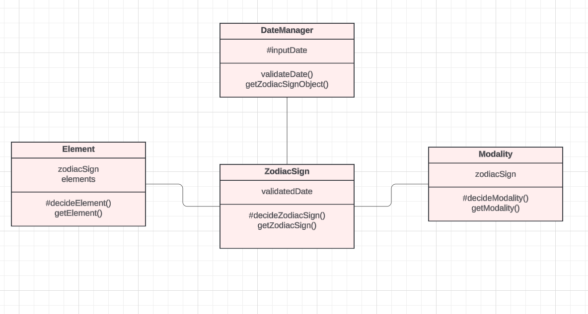

# Astrology Module

Version: 1.0.0  
Language: JavaScript  

The Astrology module is designed to help you retrieve astrological data based on a given date. As for now, the data it provides are the zodiac sign, the element, and the modality as well as validating dates.

The module is ideal for developers wanting to have easy access to astrological data or for those developing an astrology-based application.

**Features include:**
- Date validation
- Zodiac sign retrieval
- Element retrieval
- Modality retrieval

**The module allows you to:**  
Validate dates to ensure they are valid and in the correct YYYY-MM-DD format.
Retrieve the zodiac sign associated with a validated date.
Get additional astrological information, such as the element (Fire, Earth, Air, Water) and modality (Cardinal, Fixed, Mutable) for a given zodiac sign.

# Installation 

To use the module, follow these steps:

**Clone the repository from GitHub:**  
git clone https://github.com/LiAb23/astrology-module.git

**Move the module into your project:**  
move the lib folder into the src directory of your project

**Install dependencies using:**  
npm install

**Import the module into your project:**  
import { DateManager } from './src/lib/DateManager.js'

# Example use

This is an example on how to use the Astrology module in your project:

import { DateManager } from './src/lib/DateManager.js'

try {  
  const dateManager = new DateManager('2023-03-30')  
  const zodiacSign = dateManager.getZodiacSignObject().getZodiacSign()  
  const element = new Element(zodiacSign).getElement()  
  const modality = new Modality(zodiacSign).getModality()  
  
  console.log(`Zodiac sign: ${zodiacSign}`)  
  console.log(`Element: ${element}`)  
  console.log(`Modality: ${modality}`)  
} catch (error) {  
  console.log(error.message)  
}  

**Expected output:**  
Zodiac sign: ♈Aries  
Element: 🔥 Fire  
Modality: Cardinal  

# Dependencies

The Astrology module does not rely on external dependencies, aside from the development tool ESLint for code quality.

**Development dependency:**  
 "@lnu/eslint-config": "1.1.10"

# Module overview

Public methods include:

**validateDate()**

Arguments: none

Returns: A string in ISO 8601 format (YYYY-MM-DD) if the provided date is valid.
Throws an error if the date is not in the correct format or if it is invalid.

**getZodiacSignObject()**

Arguments: none

Returns: An object of type ZodiacSign, which represents the zodiac sign for the validated date.

**getZodiacSign()**

Arguments: none

Returns: A string representing the zodiac sign (e.g., ♉Taurus) corresponding to the validated date.

**getModality()**

Arguments: none

Returns: A string representing the modality (Cardinal, Fixed, Mutable) associated with the given zodiac sign.

**getElement()**

Arguments: none

Returns: A string representing the element (🔥 Fire, 🌍 Earth, 💨 Air, 💧 Water) corresponding to the given zodiac sign.

# Testing

To test the Astrology module, manual testcases that cover each method can be found in testApp.js.

To run the tests, use the following command:  
npm test

# Bug reports

Any bugs found during testing are documented in [bugrapport.md](./bugrapport.md).

# License

Copyright (c) [2024] [Liv Åberg]  
This project is licensed under the terms of the MIT license. For full license information, see LICENSE file.

 # Updates

 This is the first version of the module (1.0.0). Currently, there are no planned updates. Any potential future changes will follow semantic versioning (major.minor.patch).

# Syntax

This project follows the ESLint configuration provided by `@lnu/eslint-config`, which enforces consistent coding standards throughout the project. Ensure that ESLint is properly configured in your development environment to maintain code quality.

# Requirements

For more detailed information on the module's requirements, refer to the [Module Requirements](https://docs.google.com/document/d/1Fi_4C4SgL3FA1h_9j9_2Opu39FLBGUjsPr1sRMULy_U/edit?pli=1#heading=h.wdcld312ubab) document. 

# Contributions

We welcome contributions from the community! If you'd like to contribute, follow these steps:

1. Fork the repository.
2. Create a new branch for your feature or fix.
3. Make your changes and commit them with clear and descriptive messages.
4. Submit a pull request for review.

For questions or discussions, feel free to reach out via the project's GitHub Issues page.

